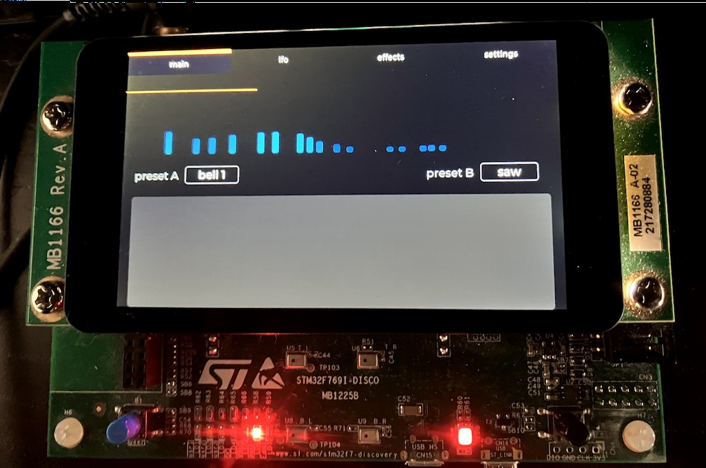

## Physical Modeling Modal synthesizer on STM32F769i-Disco board, with touchscreen support and built-in effects.

- 16-band resonator filterbank
- Spectrum interpolation/morphing by finger swiping the spectrum area
- 16-phase LFO for individual amplitude modulation of each partial, with up to audio-rate modulation (= ring modulation)
- Stereo delay effect
- Stereo reverberation effect
- Touchscreen support, LVGL-based GUI

### TODO:
- [x] 2nd GUI page for effects settings
- [ ] Load new spectra definitions via SD Card
- [ ] USB device mode for MIDI control
- [x] double buffering to prevent display flickering

_____________________________________________________

Except as otherwise noted, all files are

    Copyright (c) 2026 Johannes Regnier

For information on usage and redistribution, and for a Disclaimer of Warranty and Limitation of Liability, see LICENSE.
